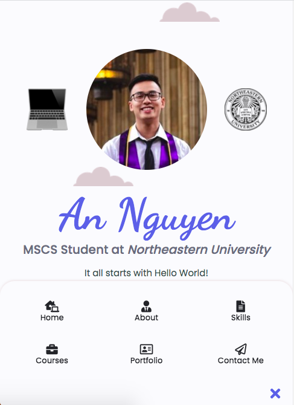
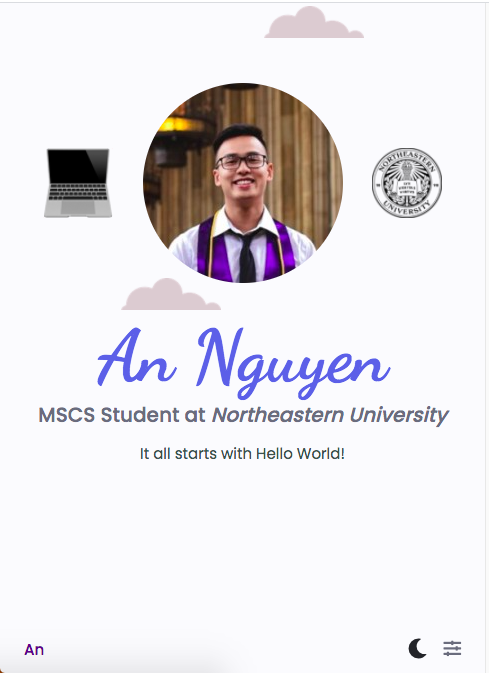

# PersonalWebsite-AnNguyen

Click on this [link]() to view site on Heroku

## Assignment components

* There is a landing page of `index.html` and 1 additional page of `contact.html`. 

* Everything is easy to navigate with navigation bar: it has 6 elements of Home, About, Skills, Courses, Portfolio and Contact Me.
> Visual of Home section
    * When site is on desktop or any large device, nav bar is at the header position.
    
    * When window is resized to smaller screen, nav bar is at footer position, and it will have a nice little feature of JavaScripts for user to toggle the bar.
     | 

* Click on any of this element will direct the user to 1 of 6 internal link

Favicons are from: https://www.iconfinder.com/icons/7033730/among_us_icon

Dark color theme are from: https://draculatheme.com/contribute

