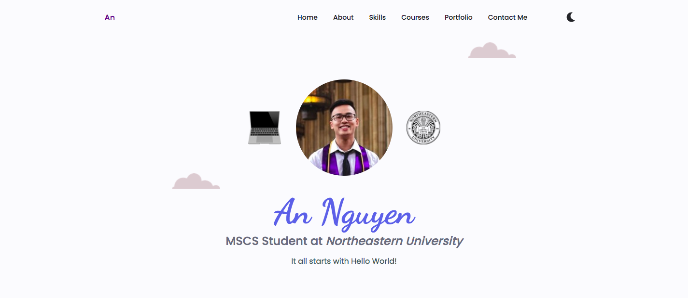
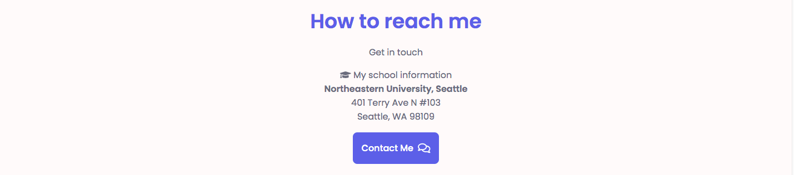
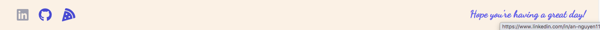
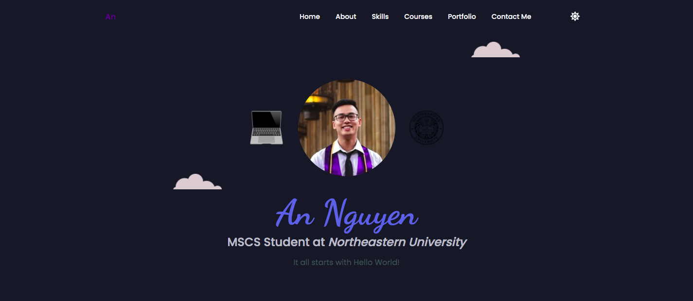

# PersonalWebsite-AnNguyen

Click on this [link]() to view site on Heroku

## Assignment components

#### Landing page

There is a landing page of `index.html` and 1 additional page of `contact.html`. 

#### Nav Bar

Everything is easy to navigate with navigation bar: it has 6 elements of *Home*, *About*, *Skills*, *Courses*, *Portfolio* and *Contact Me*.
* When site is on desktop or any large device, nav bar is at the header position.
 
> Visual of Home section

* When window is resized to smaller screen, nav bar is at footer position, and it has a nice little feature of **JavaScript** for user to toggle the bar.

 

#### Internal Links

Click on any of the element in nav bar will direct the user to 1 of 6 specific HTML elements, which are equally styled and appealing. User can also go to `contact.html` by directing to *Contact Me* section and hit that button.

* About section

 

* Course section

 

* Contact Me section - where user can click on the button and be redirected to separate page. 

 

On `contact.html` - User can also choose to go back to the main page with a button at bottom - left

 

#### External Links

On the bottom of the page, there are 3 logos of *GitHub*, *LinkedIn* and *Piazza* where user can click on to go to.

 

#### HTML table

Skills section is implemented with a HTML table and CSS elements for visualization (color, spacing, border, shadow, ...)

 

#### Interactive Components

Several components across the site:
* The nav bar switched from header to footer
* Toggle nav bar when it's footer
* Hover languages in *Skills* section to display some words
* Hover over buttons across the both `index.html` and `contact.html`
* Hover over logos (for external links) at footer
* Major feature using **JavaScript** and **jQuery**:
    * In nav bar there's a little icon of either *Sun* or *Moon*, where user can click on to change the theme of the site

 

#### Responsiveness

I hope my illustration through pictures in this README fulfills this requirement 😆

## Resources

Among us [favicons](https://www.iconfinder.com/icons/7033730/among_us_icon)
Dark color/ theme inspired from [Dracula Theme](https://draculatheme.com/contribute)
[Emoji](https://emojipedia.org/)
[Gif](https://giphy.com/)
Google [Fonts](https://fonts.google.com/)
Small [icons](https://fontawesome.com/) across the site

And for any other pictures, it's our friendly google.com